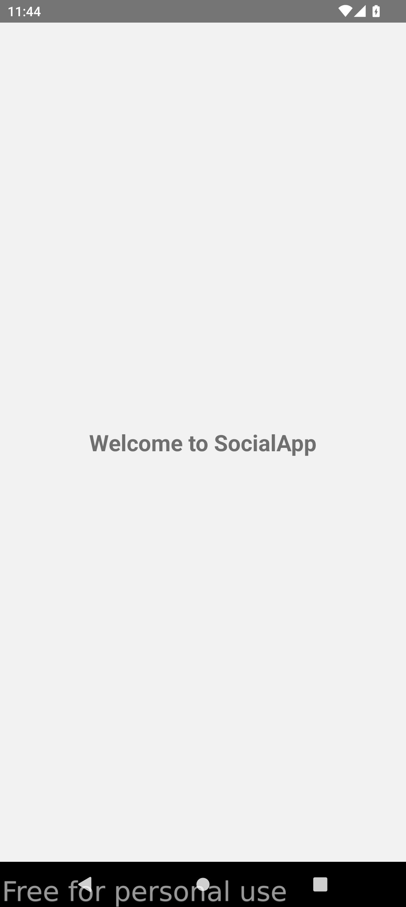
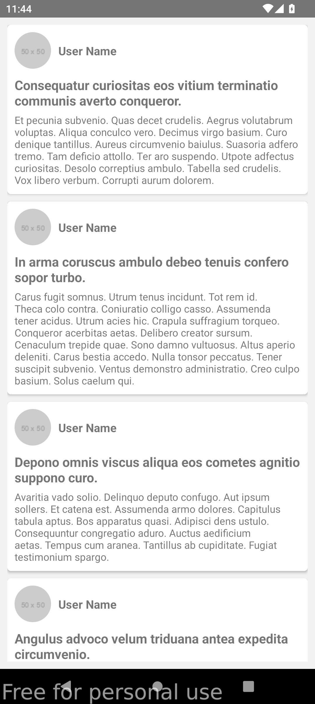
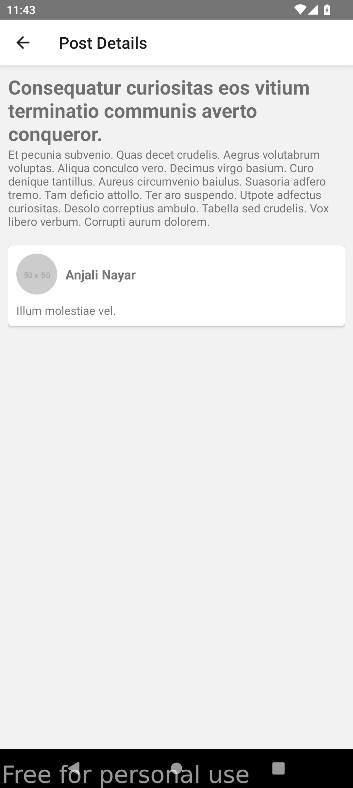

# Breadfast Mobile Task - React Native

This project is a sample social mobile application developed using React Native. It includes three screens: Splash screen, Home (List of posts), and Post details. The application fetches data from the [GoRest API](https://gorest.co.in/public/v2/posts) to display posts and comments.

## Features

- Splash screen with app initialization logic.
- Home screen displaying a list of posts fetched from the API.
- Post details screen showing the details of a selected post, including comments.

## Screenshots

<div style="display: flex; justify-content: space-between;">
  

  

  
</div>

## Technologies Used

- React Native
- TypeScript
- Redux Toolkit for state management
- Styled Components for styling
- Axios for API requests

## Getting Started

To get a local copy up and running, follow these steps:

1. **Clone the repository:**

   ```bash
   git clone https://github.com/your/repository.git
   cd repository
   ```

2. **Install dependencies:**

   ```bash
   npm install
   ```

3. **Run the application:**

   - For iOS:

     ```bash
     npx react-native run-ios
     ```

   - For Android:

     ```bash
     npx react-native run-android
     ```

4. **Explore the code:**

   - The main screens are located in the `src/screens` directory.
   - Redux state management logic can be found in `src/redux/slices`.
   - Components used throughout the app are in `src/components`.

## Contributors

- Bishoy Makkar
- bishoy.makkar@gmail.com

---